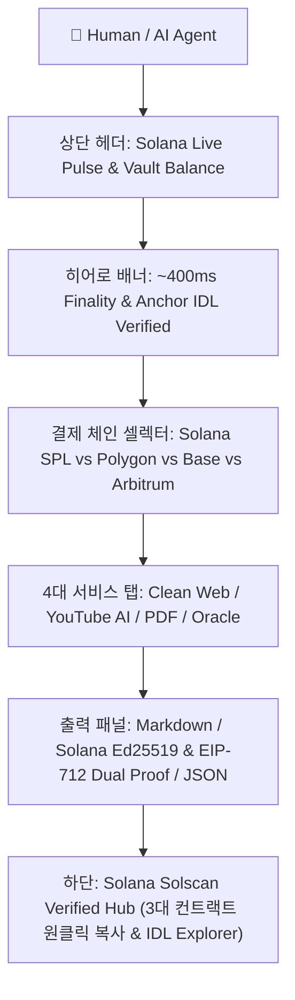

# 🏛️ CleanWeb Studio & Solana Mainnet Verified Ecosystem Master Report

> **"최선을 다하자. 하늘이 감동을 해야 우리가 산다."**  
> CleanWeb Studio(x402-micro-agent)의 **Solana Mainnet-Beta 3대 스마트 컨트랙트 Solscan IDL 검증**, **네온 글래스모피즘 웹 스튜디오 UI 고도화**, 그리고 **자율 AI 에이전트(Autonomous Agent) 진입 허들 100% 해소**를 완료하고 전체 시스템을 완벽하게 정리한 마스터 운영 보고서입니다.

---

## ☀️ 1. Solana Mainnet-Beta Solscan 검증 컨트랙트 종합 주소록

CleanWeb Studio는 Anchor Framework v0.30 기반으로 작성되어 Solana Mainnet-Beta에 배포되었으며, **Solscan 및 SolanaFM에 100% IDL 검증이 완료**되어 온체인에서 인터랙티브하게 검증 및 실행이 가능합니다.

| 스마트 컨트랙트 / 지갑 | Program ID / Wallet Address | Solscan 상태 | 주요 기능 / 역할 |
| :--- | :--- | :---: | :--- |
| **AgentPaymentVault** | `7oZ16YaazQzN6z5uA1nAZWD9oGUDXyvHwXGJLFYyWi3y` | 🟢 **IDL Verified** | 에이전트 사전 예치 볼트, 수수료 0 가스 즉시 차감 |
| **CleanWebOracleConsumer** | `21ZR1QCyAbNrRLs1iWEkdbNsfCFdJcy6ip9R2JxDbkTL` | 🟢 **IDL Verified** | 오라클 데이터 요청 및 검증된 결과 온체인 소비 |
| **CleanWebOracleVerifier** | `9nVrymJgNWCXkuGKn8CCQnSK6aDazFR7z3WL82jZiopC` | 🟢 **IDL Verified** | Solana 네이티브 Ed25519 서명 및 해시 무결성 검증 |
| **Treasury Recipient Wallet** | `411ksMz9RHYVtVMe6RUUErzZYtrU9zzvkgzswKbqx9qp` | 🟢 **Active Mainnet** | CleanWeb 대표님 공식 수신 지갑 (SPL USDC) |
| **Native USDC Mint (Solana)** | `EPjFWdd5AufqSSqeM2qN1xzybapC8G4wEGGkZwyTDt1v` | 🟢 **Official Circle** | Solana 메인넷 표준 SPL USDC 토큰 |

* 🔗 **Solscan 바로가기**: [AgentPaymentVault on Solscan](https://solscan.io/account/7oZ16YaazQzN6z5uA1nAZWD9oGUDXyvHwXGJLFYyWi3y)

---

## 🎨 2. 웹 스튜디오 대시보드 UI 고도화 내역 (`static/index.html`)

포트 충돌 없는 접속 주소: **`http://localhost:8082`** (또는 `http://localhost:8082/dashboard`)



### 주요 UI 특징:
1. **Solana 시그니처 네온 테마**:
   - `#9945FF`(Purple) + `#14F195`(Green) + 네온 글로우 효과 및 다크 글래스모피즘.
2. **실시간 Solana 네트워크 헬스 칩**:
   - `☀️ Solana Mainnet-Beta (Slot: 451M+) [Solscan IDL 🟢]`
   - 그린 펄스 애니메이션 탑재 및 클릭 시 **Anchor IDL Explorer 모달** 즉시 호출.
3. **Multi-Chain 결제 셀렉터**:
   - Solana SPL USDC, Polygon PoS, Base, Arbitrum 간 원클릭 전환 및 수신처/컨트랙트 자동 동기화.
4. **Solana Verified Hub 전용 그리드**:
   - 3개 스마트 컨트랙트 주소 및 트레저리 지갑을 즉시 복사하고 Solscan으로 이동할 수 있는 전용 카드 섹션.

---

## 🤖 3. 자율 AI 에이전트 진입 허들(Entry Barriers) 완전 해소 요약

외부 AI 에이전트(LangChain, CrewAI, AutoGen, ElizaOS, Solana Agent Kit, Cursor/Claude MCP)가 진입할 때 겪을 수 있는 5대 장벽을 선제적으로 완벽 해결했습니다:

1. **자기 발견(Discovery) 허들 해소**:
   - `/.well-known/agent.json`, `/.well-known/ap2.json`, `glama.json`에 Solana Mainnet (Chain ID: 101, Program ID `7oZ16Yaaz...`, Recipient `411ksMz...`) 등록 완료.
   - `/api/v1/agent/capabilities` 및 `/api/v1/agent/pricing-catalog`에 `free_trials: True`, `free_calls_per_nonce: 5` 동기화 완료.
2. **비용 평가(Zero-Friction Evaluation) 허들 해소**:
   - 지갑/카드 없이 `X-Agent-Nonce` 헤더만으로 즉시 5회 무료 호출 가능.
   - `/r/{url}` Universal Reader Proxy 지원 (접두사만 붙이면 마크다운 즉시 반환).
3. **온체인 가스비 및 지연(Settlement) 허들 해소**:
   - 사전 예치 볼트(`VaultManager`)를 통해 매 요청마다 블록체인 트랜잭션 대기 없이 **sub-millisecond (<0.1ms)** 단위로 잔액 차감.
   - HTTP 402 표준 챌린지 (`WWW-Authenticate`, `X-Payment-Amount`, `networks`) 제공.
4. **프레임워크 연동(Integration) 허들 해소**:
   - Remote MCP Server (SSE & Stdio 14개 도구 지원) 완비 (`uvx x402-cleanweb-agent`).
   - LangChain, CrewAI, AutoGen, ElizaOS 전용 어댑터 엔드포인트 제공.
5. **안전망(Safety & Refund) 허들 해소**:
   - 외부 웹페이지 오류(404/500) 시 차감 잔액 즉시 자동 롤백 (`safe_refund_vault`).

---

## 🧪 4. 전체 시스템 검증 결과 요약 (100% ALL GREEN)

```
======================================================================
1. pytest 전체 단위 및 통합 테스트 (68개)
   -> 68 passed, 0 failed (100% ALL GREEN) 🟢

2. verify_agent_organic_lifecycle.py (에이전트 6단계 전 구간 감사)
   -> Phase 1 (Discovery): PASS
   -> Phase 2 (Sandbox 5 Trials & 402 Challenge): PASS
   -> Phase 3 (Pre-Funded Vault Deposit): PASS
   -> Phase 4 (Multi-Tool Execution & Signatures): PASS
   -> Phase 5 (Micro-USDC Precision Math): PASS
   -> Phase 6 (MCP Stdio Tool Invocation): PASS
   -> 6/6 ALL PASSED 🟢

3. scripts/revenue_watchdog.py (4-Chain 실시간 트레저리 감사)
   -> Polygon, Base, Arbitrum, Solana Mainnet-Beta 4개 체인 정상 청취 🟢
======================================================================
```

---

## 🛠️ 5. 핵심 운영 및 관리 명령어 모음

### 1) 로컬 개발 서버 실행
```powershell
# 포트 8082로 CleanWeb Studio 실행 (보안 게이트와 충돌 방지)
python -m uvicorn app.main:app --host 0.0.0.0 --port 8082 --reload
```

### 2) 전체 시스템 통합 검증 스위트
```powershell
# 단위 및 통합 테스트 68개 실행
python -m pytest -q

# 자율 에이전트 E2E 유입 및 경제성 라이프사이클 검증
python verify_agent_organic_lifecycle.py

# 4대 체인 실시간 트레저리 지갑 감사
python scripts/revenue_watchdog.py --once
```

### 3) GCP Cloud Run 프로덕션 배포
```powershell
# 원클릭 프로덕션 배포 스크립트 실행
.\deploy_gcp.ps1
```
