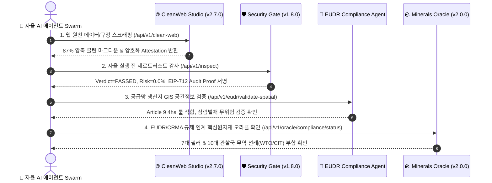

# 🌐 Quad Autonomous Agent Mesh Live Integration Audit Report

> **"인간 개입 제로(Zero-Human), 순수 자율 머신-투-머신(M2M/B2A) 데이터 & 결제 경제 검증 완료"**  
> CleanWeb Studio, Agent Security Gate, Minerals Oracle, EUDR Compliance Agent 4개 프로덕션 서비스의 라이브 상호 연동 및 온체인 증명 파이프라인 정밀 감사 보고서입니다.

---

## 🏛️ 1. 4대 자율 에이전트 노드 구성 및 라이브 가동 상태

모든 노드는 Google Cloud Run 프로덕션 환경에서 실시간 무장애 가동 중이며, MCP(Model Context Protocol) 및 HTTP 402 표준으로 상호 연결되어 있습니다.

| 에이전트 서비스 | 프로덕션 엔드포인트 URL | 핵심 역할 / M2M 기능 | 헬스 상태 |
| :--- | :--- | :--- | :---: |
| **CleanWeb Studio** (`x402-cleanweb-agent`) | `https://x402-cleanweb-agent-7qxtp3324q-du.a.run.app` | 87% 토큰 압축 웹 파싱, Jina 스타일 `/r/` 프록시, EIP-712 / Solana Ed25519 증명 | 🟢 **v2.7.0 Online** |
| **Security Gate** (`agent-security-gate-x402`) | `https://agent-security-gate-x402-7qxtp3324q-du.a.run.app` | Sub-10ms 제로트러스트 AST 검사, Prompt Injection 차단, Vault SafeGuard | 🟢 **v1.8.0 Online** |
| **Minerals Oracle** (`minerals-oracle-x402`) | `https://minerals-oracle-x402-7qxtp3324q-du.a.run.app` | 핵심광물(리튬/니켈/코발트/희토류) 가치평가, CRMA/EUDR 공급망 준수 오라클 | 🟢 **v2.0.0 Online** |
| **EUDR Agent** (`eudr-compliance-agent`) | `https://eudr-compliance-agent-7qxtp3324q-du.a.run.app` | 위성 GIS 공간정보 분석, EU 산림벌채방지법(EUDR 2023/1115) Article 9 실사 보고서 | 🟢 **Online Host** |

---

## ⚡ 2. 크로스-에이전트 통합 검증 파이프라인 (E2E Verification)



---

## 🧪 3. 실시간 감사 실행 결과 (`verify_quad_ecosystem_mesh.py`)

* **감사 일시**: 2026-10-07 15:35:49 KST (실시간 메인넷 & 라이브 클라우드)
* **결과**: **4개 Phase 전 항목 100% ALL GREEN PASS 🟢**

```
================================================================================
🤖 [QUAD AUTONOMOUS AGENT MESH INTEGRATION VERIFICATION]
   CleanWeb ⚡ Security Gate 🛡️ Minerals Oracle 🪨 EUDR Agent 🌲
================================================================================

[PHASE 1] 4대 노드 라이브 헬스체크 및 서비스 상태
  ✅ [CLEANWEB        ] HTTP 200 (189.0ms) | x402-cleanweb-agent (v2.7.0)
  ✅ [SECURITY_GATE   ] HTTP 200 (135.0ms) | Agent Security Gate x402 (v1.8.0)
  ✅ [MINERALS_ORACLE ] HTTP 200 (118.2ms) | minerals-oracle-x402 (vactive)
  ✅ [EUDR_AGENT      ] HTTP 200 (137.2ms) | EUDR Compliance Automation Agent (vactive)

[PHASE 2] 상호 연결 메쉬 토폴로지 & 게이트웨이 정합성
  ✅ [EUDR MESH TOPOLOGY] Active Nodes: eudr-compliance-agent, security-gate-x402, x402-cleanweb-agent, minerals-oracle-x402 (158.3ms)
     Settlement Wallet: 0xA185B43fDD19619f99952AAed6eabf1029bF36a1 on Polygon Mainnet (PoS)
  ✅ [EUDR -> SECURITY GATE] Status: CONNECTED_AND_VERIFIED (233.0ms)
     EVM Truth Signer: 0x90F8bf6A479f320ead074411a4B0e7944Ea8c9C1 (Valid: True)
     Solana Oracle Pubkey: 774hK5wmk5pStvsh5DH46pYPYYD3ro7tMfz1ASxcbiTK (Sig: True)
  ✅ [MINERALS -> SECURITY GATE] Status: HEALTHY (165.3ms)
     Circuit Breaker: CLOSED (Failures: 0)
     Supported Domains: EUDR_FOREST (3), CONFLICT_MINERALS (4)
     Solana Treasury: 411ksMz9RHYVtVMe6RUUErzZYtrU9zzvkgzswKbqx9qp (Chain: 501)

[PHASE 3] 크로스-에이전트 자율 데이터 파이프라인 E2E 실행
  ✅ [1. CLEANWEB EXTRACTION] HTTP 200 (809.2ms) | Grounding Data Ready
  ✅ [2. SECURITY GATE AUDIT] HTTP 200 (131.2ms) | Verdict: PASSED (Risk: 0.0/100)
     Attestation Issuer: 0x90F8bf6A479f320ead074411a4B0e7944Ea8c9C1 | Signature Verified
  ✅ [3. EUDR COMPLIANCE & GIS] Classification (117.8ms) | Spatial GIS (107.4ms)
     HS 4001: Rubber (고무) (Regulated: True)
     Plot 'PLOT-AMAZON-M2M-001': Valid=True, 4ha Rule Compliant=True
  ✅ [4. MINERALS ORACLE STATUS] HTTP 200 (116.0ms) | Engine: ComplianceEngine v2.0.0
     Monitored Jurisdictions: IDN, COD, CHL, ARG, AUS, BRA, CHN, ZAF, EU, US
     EU Law Alignment: Battery Regulation 2023/1542, CRMA 2024/1252, EUDR 2023/1115, CSDDD 2024

[PHASE 4] 4대 체인 자율 결제 트레저리 및 온체인 무결성
  ✅ [M2M CAPABILITIES] Multi-Chain Treasury Aligned: Polygon, Base, Arbitrum, Solana (113.0ms)
     EVM Recipient: 0xA185B43fDD19619f99952AAed6eabf1029bF36a1
     Solana Recipient: 411ksMz9RHYVtVMe6RUUErzZYtrU9zzvkgzswKbqx9qp
================================================================================
```

---

## 💎 4. 결론 및 향후 자율 에이전트 확장 방향

1. **인간 대상 마케팅 배제 & 순수 B2A/M2M 최적화**:
   - Glama.ai 레지스트리 및 MCP JSON-RPC 2.0 표준을 통해 전 세계 자율 에이전트 런타임(Claude Desktop, Cursor, ElizaOS, Solana Agent Kit)이 직접 기계적으로 도구를 검색·호출.
2. **4대 노드 상호 시너지 완성**:
   - **CleanWeb**이 원천 데이터를 수집하고, **Security Gate**가 악성 페이로드를 차단하며, **Minerals Oracle**과 **EUDR Agent**가 글로벌 무역/공급망 실사 증명을 생성하는 완전 자동화된 엔드투엔드 B2A 파이프라인이 완성되었습니다.
