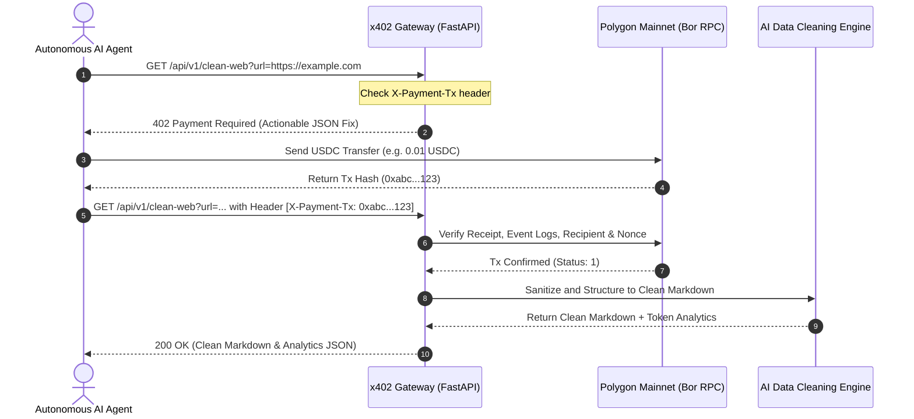

# ⚡ x402-cleanweb-agent

> **Turn any messy webpage, YouTube video, or PDF paper into pure, LLM-ready clean Markdown on Polygon.**  
> *Zero Sign-up. Zero Subscriptions. True Machine-to-Machine HTTP 402 Micropayments for Autonomous AI Agents.*

[](https://pypi.org/project/x402-cleanweb-agent/)
[](https://pypi.org/project/x402-cleanweb-agent/)
[](https://x402-cleanweb-agent.onrender.com/llms.txt)
[](https://x402-cleanweb-agent.onrender.com)
[](https://x402-cleanweb-agent.onrender.com/docs)
[](https://polygonscan.com/token/0x3c499c542cEF5E3811e1192ce70d8cC03d5c3359)
[](https://opensource.org/licenses/MIT)

---

## 💡 Why x402-cleanweb-agent?

Traditional web scraping and data extraction APIs force expensive **$49/month subscriptions** and complex API key management.

`x402-cleanweb-agent` solves this for autonomous AI agents, scrapers, and developers:

- 📦 **PyPI Distributed**: `pip install x402-cleanweb-agent` or zero-install with `uvx x402-cleanweb-agent`.
- ❌ **No Monthly Subscriptions**: Pay only for what you query ($0.005 ~ $0.05 per call in USDC).
- ❌ **No Sign-ups or API Keys**: Native **HTTP 402 Payment Required** machine-to-machine protocol.
- 🤖 **Zero-Human AI Agent Ready**: AI agents with a crypto wallet can autonomously buy data 24/7.
- 🧠 **Self-Healing Error Handling**: Structured JSON actionable responses for automatic recovery on payment failure.
- 📦 **Batch Multi-URL Scraping**: Concurrently scrape up to 10 URLs in 1 transaction.
- ⚡ **0.01s LRU In-Memory Cache**: Zero latency on repeated queries.
- 📊 **Token Savings Engine**: Calculates raw vs. cleaned token reduction (avg. 60~85% savings) and estimated LLM prompt cost savings ($).

---

## 🚀 Live Demo & Service Endpoints

- 📦 **PyPI Package**: [https://pypi.org/project/x402-cleanweb-agent/](https://pypi.org/project/x402-cleanweb-agent/)
- 🌐 **Web3 DApp UI**: [https://x402-cleanweb-agent.onrender.com](https://x402-cleanweb-agent.onrender.com)
- 📑 **LLM Documentation**: [https://x402-cleanweb-agent.onrender.com/llms.txt](https://x402-cleanweb-agent.onrender.com/llms.txt)
- 📚 **Swagger API Docs**: [https://x402-cleanweb-agent.onrender.com/docs](https://x402-cleanweb-agent.onrender.com/docs)
- 🤖 **Agent Manifest**: [https://x402-cleanweb-agent.onrender.com/.well-known/agent.json](https://x402-cleanweb-agent.onrender.com/.well-known/agent.json)

| Service | Endpoint | Pricing | Output & Description |
| :--- | :--- | :--- | :--- |
| **🌐 Clean Web** | `GET /api/v1/clean-web` | **0.01 USDC** | Ad/Noise removal + AI-ready Markdown + **Token Savings Analytics** |
| **📦 Batch Clean** | `POST /api/v1/batch-clean` | **0.01 / URL** | Up to 10 URLs parallel batch scraping in 1 on-chain transaction |
| **🎬 YouTube Transcript** | `GET /api/v1/clean-youtube` | **0.02 USDC** | Full video **transcripts with timestamps** formatted in Markdown |
| **📑 PDF Paper & Report** | `GET /api/v1/clean-pdf` | **0.05 USDC** | arXiv papers & earnings reports converted into **structured Markdown** |
| **📝 Pure Plain Text** | `GET /api/v1/clean-text` | **0.005 USDC** | Ultra-lightweight raw text extraction for fast vector indexing |

---

## 📦 Quick Installation

```bash
# Standard installation from PyPI
pip install x402-cleanweb-agent

# Or run instantly without installation via uvx
uvx x402-cleanweb-agent
```

---

## 🤖 Zero-Human Autonomous AI Agent Integration & Tools

AI agents with a Polygon wallet (Private Key) can autonomously handle payment and data extraction with **zero human intervention** and **built-in Budget Guard protection**:

### 1. Ready-to-Use Agent Toolkit

```python
from agent_tools import X402AgentToolkit

# 1. Initialize toolkit with spending limits
toolkit = X402AgentToolkit(
    private_key="0xYOUR_AGENT_PRIVATE_KEY",
    max_daily_budget_usdc=1.0  # Budget Guard protects against runaway costs
)

# 2. Clean single webpage
web_data = toolkit.clean_web("https://news.ycombinator.com", density="compact")

# 3. Batch clean multiple URLs in parallel (1 transaction)
batch_data = toolkit.batch_clean([
    "https://polygon.technology",
    "https://ethereum.org"
])

# 4. Extract YouTube transcript with timestamps
yt_data = toolkit.clean_youtube("https://www.youtube.com/watch?v=dQw4w9WgXcQ")

# 5. Extract PDF paper
pdf_data = toolkit.clean_pdf("https://arxiv.org/pdf/2301.00001.pdf")

# 6. Check spending report
print(toolkit.get_spending_report())
```

### 2. Integration with AI Agent Frameworks

#### CrewAI
```python
from crewai import Agent
from agent_tools import get_x402_agent_tools

tools = get_x402_agent_tools(private_key="0xYOUR_AGENT_KEY")
researcher = Agent(
    role="Web Data Researcher",
    goal="Extract token-optimized clean web data and transcripts autonomously with Polygon micropayments",
    tools=tools,
    verbose=True
)
```

#### LangChain / smolagents / AutoGen
```python
from agent_tools import X402AgentToolkit

toolkit = X402AgentToolkit(private_key="0xYOUR_AGENT_KEY")
tools = toolkit.get_tools_list()  # Standard Python Callables
openai_schemas = toolkit.get_openai_function_schemas()  # OpenAI Tool Call Schemas
```

---

## 🛠️ How It Works (M2M Architecture)



---

## 🔌 Model Context Protocol (MCP) Setup

### Option 1: 1-Click Auto Installer (Recommended)
Automatically configures Claude Desktop & Cursor without editing JSON files:

```bash
# Windows
install_mcp.bat

# macOS / Linux
python install_mcp.py
```

---

### Option 2: Run via `uvx` (No installation needed)
Add directly to your `claude_desktop_config.json` or Cursor `mcp.json`:

```json
{
  "mcpServers": {
    "polygon-x402-cleanweb": {
      "command": "uvx",
      "args": ["x402-cleanweb-agent"],
      "env": {
        "POLYGON_RPC_URL": "https://polygon-bor-rpc.publicnode.com"
      }
    }
  }
}
```

### Exposed MCP Tools

- `get_payment_info()`: Retrieve pricing tiers and recipient address.
- `fetch_clean_markdown(url, payment_tx_hash)`: Clean Web scraper (0.01 USDC).
- `fetch_batch_clean_markdown(urls, payment_tx_hash)`: Concurrent Multi-URL batch scraper (0.01 USDC / URL).
- `fetch_youtube_transcript(url, language, payment_tx_hash)`: YouTube transcript extractor (0.02 USDC).
- `fetch_pdf_markdown(url, payment_tx_hash)`: PDF research paper converter (0.05 USDC).
- `fetch_plain_text(url, payment_tx_hash)`: Lightweight text scraper (0.005 USDC).

---

## 📜 On-Chain Contract & Network Details

- **Network**: Polygon Mainnet (Chain ID: `137`)
- **Token Contract (USDC)**: [`0x3c499c542cEF5E3811e1192ce70d8cC03d5c3359`](https://polygonscan.com/token/0x3c499c542cEF5E3811e1192ce70d8cC03d5c3359)
- **Recipient Treasury**: `0x255F9991233f86B29dB847c8d5b8CB9915e80dCf`
- **Standard**: [HTTP 402 Payment Required](https://developer.mozilla.org/en-US/docs/Web/HTTP/Status/402)

---

## 🤝 Contributing & License

Contributions and suggestions are welcome!  
Feel free to open an issue or pull request on GitHub: [https://github.com/nohosa001-pixel/x402-cleanweb-agent/issues](https://github.com/nohosa001-pixel/x402-cleanweb-agent/issues)

Distributed under the **MIT License**.
