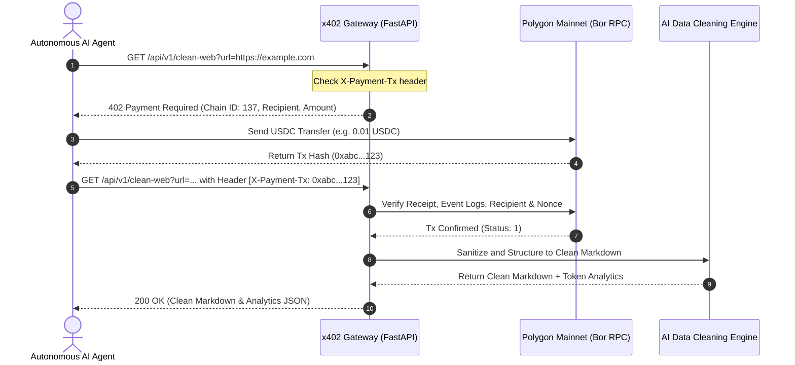

# ⚡ x402-cleanweb-agent

> **Turn any messy webpage, YouTube video, or PDF paper into pure, LLM-ready clean Markdown on Polygon.**  
> *Zero Sign-up. Zero Subscriptions. True Machine-to-Machine HTTP 402 Micropayments for Autonomous AI Agents.*

[](https://x402-cleanweb-agent.onrender.com)
[](https://x402-cleanweb-agent.onrender.com/docs)
[](https://www.python.org/)
[](https://polygonscan.com/token/0x3c499c542cEF5E3811e1192ce70d8cC03d5c3359)
[](https://opensource.org/licenses/MIT)

---

## 💡 Why x402-cleanweb-agent?

Traditional web scraping and data extraction APIs force expensive **$49/month subscriptions** and complex API key management.

`x402-cleanweb-agent` solves this for autonomous AI agents, scrapers, and developers:

- ❌ **No Monthly Subscriptions**: Pay only for what you query ($0.005 ~ $0.05 per call in USDC).
- ❌ **No Sign-ups or API Keys**: Native **HTTP 402 Payment Required** machine-to-machine protocol.
- 🤖 **Zero-Human AI Agent Ready**: AI agents with a crypto wallet can autonomously buy data 24/7.
- ⚡ **Sub-Second Speed**: Strips ads, tracking scripts, and clutter, returning pure, structured Markdown.
- 🪙 **Ultra-Low Gas Fees**: Powered by **Polygon PoS** (< $0.005 network gas).
- 📊 **Token Savings Engine**: Calculates raw vs. cleaned token reduction (avg. 60~85% savings) and estimated LLM prompt cost savings ($).

---

## 🚀 Live Demo & Service Endpoints

- 🌐 **Web3 DApp UI**: [https://x402-cleanweb-agent.onrender.com](https://x402-cleanweb-agent.onrender.com)
- 📚 **Swagger API Docs**: [https://x402-cleanweb-agent.onrender.com/docs](https://x402-cleanweb-agent.onrender.com/docs)
- 📂 **GitHub Repo**: [https://github.com/nohosa001-pixel/x402-cleanweb-agent](https://github.com/nohosa001-pixel/x402-cleanweb-agent)

| Service | Endpoint | Pricing | Output & Description |
| :--- | :--- | :--- | :--- |
| **🌐 Clean Web** | `GET /api/v1/clean-web` | **0.01 USDC** | Ad/Noise removal + AI-ready Markdown + **Token Savings Analytics** |
| **🎬 YouTube Transcript** | `GET /api/v1/clean-youtube` | **0.02 USDC** | Full video **transcripts with timestamps** formatted in Markdown |
| **📑 PDF Paper & Report** | `GET /api/v1/clean-pdf` | **0.05 USDC** | arXiv papers & earnings reports converted into **structured Markdown** |
| **📝 Pure Plain Text** | `GET /api/v1/clean-text` | **0.005 USDC** | Ultra-lightweight raw text extraction for fast vector indexing |

---

## 🤖 Zero-Human Autonomous AI Agent Integration & Tools

AI agents with a Polygon wallet (Private Key) can autonomously handle payment and data extraction with **zero human intervention** and **built-in Budget Guard protection**:

### 1. Ready-to-Use Agent Toolkit (CrewAI / smolagents / LangChain)

```python
from agent_tools import get_x402_agent_tools, X402AgentToolkit

# 1. Initialize toolkit with spending limits
toolkit = X402AgentToolkit(
    private_key="0xYOUR_AGENT_PRIVATE_KEY",
    max_daily_budget_usdc=1.0  # Budget Guard protects against infinite loops
)

# 2. Get ready-to-use callable tools
tools = toolkit.get_tools_list()

# 3. Direct execution
web_data = toolkit.clean_web("https://example.com/article")
yt_data = toolkit.clean_youtube("https://www.youtube.com/watch?v=dQw4w9WgXcQ")
pdf_data = toolkit.clean_pdf("https://arxiv.org/pdf/2301.00001.pdf")

# 4. Inspect spending report
print(toolkit.get_spending_report())
```

### 2. Machine-Readable Agent Discovery Protocol

Autonomous agents and crawlers can discover services, pricing, and on-chain payment contracts dynamically:

- **Agent Manifest**: `GET https://x402-cleanweb-agent.onrender.com/.well-known/agent.json`
- **Real-time Pricing Catalog**: `GET https://x402-cleanweb-agent.onrender.com/api/v1/agent/pricing-catalog`


---

## 🛠️ How It Works (M2M Architecture)



---

## ⚡ Direct cURL Quickstart

```bash
# Step 1: Query without payment to inspect 402 payment requirements
curl -i -X GET "https://x402-cleanweb-agent.onrender.com/api/v1/clean-web?url=https://example.com"

# Step 2: After sending USDC on Polygon, query with transaction hash
curl -X GET "https://x402-cleanweb-agent.onrender.com/api/v1/clean-web?url=https://example.com" \
  -H "X-Payment-Tx: 0x<YOUR_POLYGON_TX_HASH>"
```

### Sample Response

```json
{
  "status": "success",
  "service": "clean-web",
  "source_url": "https://example.com",
  "title": "Example Domain",
  "markdown_content": "# Example Domain\n\nThis domain is for use in illustrative examples...",
  "token_analytics": {
    "raw_html_estimated_tokens": 1250,
    "clean_markdown_estimated_tokens": 280,
    "tokens_saved": 970,
    "token_savings_percentage": "77.6%",
    "estimated_llm_cost_saved_usd": "$0.0029"
  },
  "processing_time_seconds": 0.38
}
```

---

## 🔌 Model Context Protocol (MCP) Setup

### Option 1: 1-Click Auto Installer (Recommended)
Automatically configures Claude Desktop & Cursor without editing JSON files:

```bash
# Windows
install_mcp.bat

# macOS / Linux
python install_mcp.py
```

---

### Option 2: Run via `uvx` (No installation needed)
Add directly to your `claude_desktop_config.json` or Cursor:

```json
{
  "mcpServers": {
    "polygon-x402-cleanweb": {
      "command": "uvx",
      "args": ["--from", "git+https://github.com/nohosa001-pixel/x402-cleanweb-agent", "x402-agent"]
    }
  }
}
```

---

### Option 3: Manual Local Configuration

```json
{
  "mcpServers": {
    "polygon-x402-cleanweb": {
      "command": "python",
      "args": ["-u", "/absolute/path/to/x402-micro-agent/mcp_server.py"],
      "env": {
        "PYTHONUNBUFFERED": "1",
        "POLYGON_RPC_URL": "https://polygon-bor-rpc.publicnode.com",
        "SERVER_WALLET_ADDRESS": "0x255F9991233f86B29dB847c8d5b8CB9915e80dCf",
        "USDC_CONTRACT_ADDRESS": "0x3c499c542cEF5E3811e1192ce70d8cC03d5c3359"
      }
    }
  }
}
```

### Exposed MCP Tools

- `get_payment_info()`: Retrieve pricing tiers and recipient address.
- `fetch_clean_markdown(url, payment_tx_hash)`: Clean Web scraper (0.01 USDC).
- `fetch_youtube_transcript(url, language, payment_tx_hash)`: YouTube transcript extractor (0.02 USDC).
- `fetch_pdf_markdown(url, payment_tx_hash)`: PDF research paper converter (0.05 USDC).
- `fetch_plain_text(url, payment_tx_hash)`: Lightweight text scraper (0.005 USDC).


---

## 🛠️ Local Development & Running

```bash
# 1. Clone repository
git clone https://github.com/nohosa001-pixel/x402-cleanweb-agent.git
cd x402-cleanweb-agent

# 2. Setup virtual environment
python -m venv .venv
source .venv/bin/activate  # On Windows: .venv\Scripts\activate

# 3. Install dependencies
pip install -r requirements.txt

# 4. Start local server
python main.py
# Server running at: http://localhost:8000
```

---

## 📜 On-Chain Contract & Network Details

- **Network**: Polygon Mainnet (Chain ID: `137`)
- **Token Contract (USDC)**: [`0x3c499c542cEF5E3811e1192ce70d8cC03d5c3359`](https://polygonscan.com/token/0x3c499c542cEF5E3811e1192ce70d8cC03d5c3359)
- **Recipient Treasury**: `0x255F9991233f86B29dB847c8d5b8CB9915e80dCf`
- **Standard**: [HTTP 402 Payment Required](https://developer.mozilla.org/en-US/docs/Web/HTTP/Status/402)

---

## 🤝 Contributing & License

Contributions and suggestions are welcome!  
Feel free to open an issue or pull request on GitHub: [https://github.com/nohosa001-pixel/x402-cleanweb-agent/issues](https://github.com/nohosa001-pixel/x402-cleanweb-agent/issues)

Distributed under the **MIT License**.
