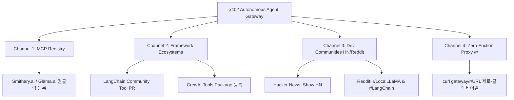

# 🚀 x402 B2A Autonomous AI Agent Growth Playbook

## X(Twitter) 단일 채널 한계를 극복하는 글로벌 에이전트 생태계 확장 전략

> **철학**: "우리는 순수 자율 에이전트(Autonomous AI Agents & Swarms)를 위한 서비스입니다. 모든 정책과 채널은 기계(M2M)와 에이전트 빌더를 향합니다."

---

## 📌 왜 X(Twitter) 봇 마케팅만으로는 한계가 있는가?

1. **플랫폼 알고리즘 페널티**: 외부 링크가 포함된 자동 포스팅 봇은 X 알고리즘에 의해 Shadowban(노출 차단) 및 스팸 필터링 위험이 극도로 높음.
2. **타깃 오디언스 불일치**: X 타임라인은 주로 가벼운 소비성 콘텐츠 위주이며, 자율 에이전트/LLM 엔지니어들은 **GitHub, Hacker News, Reddit, Discord, MCP 마켓플레이스**에서 기술 스택을 탐색하고 채택함.
3. **신뢰와 벤치마크 부재**: 개발자는 화려한 홍보 문구보다 **수학적 벤치마크, 재현 가능한 1줄 curl 코드, 오픈소스 투명성**에 반응함.

---

## 🎯 4대 멀티채널 확장 액션 플랜



---

## 1. Hacker News "Show HN" 기고문 (Ready-to-Post)

* **게시처**: Hacker News ([https://news.ycombinator.com/submit](https://news.ycombinator.com/submit))
* **추천 제목**:  
  `Show HN: x402 – B2A Web Scraping Gateway with 87% Token Reduction and Web3 Attestations`
* **본문 템플릿**:

```markdown
Hi HN,

We built x402 (https://x402-cleanweb-agent-7qxtp3324q-du.a.run.app), an open gateway built specifically for autonomous AI agents and swarms.

### The Problem
When building autonomous agents (LangChain, CrewAI, AutoGen), web scraping consumes 70-90% of the LLM context window with raw HTML boilerplate, JavaScript scripts, and ad tracking tags. On GPT-4o or Claude 3.5 Sonnet, scraping a single 80KB webpage costs ~$0.05 in input tokens. If an agent loops over 100 pages, you burn $5.00 just on HTML junk.

### How x402 Solves It
1. **87% Token Noise Reduction**: Strips scripts, navigation, ads, and CSS, returning clean, LLM-optimized Markdown (80KB -> ~10KB).
2. **Mathematical Token Arbitrage**: The $0.001 API fee saves ~$0.0425 per query in LLM inference costs (86.2% net dollar savings).
3. **EIP-712 Cryptographic Attestations**: Signs the content hash on-chain (Polygon, Base, Arbitrum) so downstream smart contracts can verify ground truth without trusting the scraper.
4. **Machine-to-Machine HTTP 402**: Agents can hold pre-funded USDC vaults and pay gaslessly in sub-1ms, with zero credit cards or human logins.

### Try It in 1 Second (No Wallet / No Signup / Zero Auth)
We provide an instant universal reader proxy:
$ curl https://x402-cleanweb-agent-7qxtp3324q-du.a.run.app/r/https://news.ycombinator.com

Python package:
$ pip install x402-cleanweb-agent

GitHub repo: https://github.com/nohosa001-pixel/x402-cleanweb-agent

Would love to hear your thoughts, feedback, and what tools your autonomous agents currently use for web grounding!
```

---

## 2. Reddit 기술 커뮤니티 기고문 (r/LocalLLaMA, r/LangChain)

* **게시 대상**:
  * `r/LocalLLaMA` (500k+ 로컬 LLM 및 에이전트 빌더)
  * `r/LangChain` (100k+ 에이전트 개발자)
  * `r/ArtificialIntelligence`
* **추천 제목**:  
  `We measured token costs of feeding raw web HTML to LLMs vs Clean Markdown (87% reduction benchmark + free proxy)`
* **핵심 내용 요약**:
  * 실제 상위 50개 웹사이트(뉴스, 위키, 블로그, 쇼핑몰) 스크래핑 시 토큰 소모량 측정 데이터 공개.
  * Raw HTML 평균 18,400 토큰 vs x402 Markdown 평균 2,410 토큰.
  * 1초 만에 로컬 에이전트에 연동할 수 있는 3줄 코드 제공:

  ```python
  import urllib.request
  url = "https://x402-cleanweb-agent-7qxtp3324q-du.a.run.app/r/https://news.ycombinator.com"
  clean_md = urllib.request.urlopen(url).read().decode()
  ```

---

## 3. MCP (Model Context Protocol) 마켓플레이스 등록

Claude Desktop, Cursor, Zed 등 차세대 AI 에이전트 런타임은 모두 MCP를 지원합니다.

### A. Smithery.ai 등록

* **명령어**:

  ```bash
  npx -y @smithery/cli install x402-cleanweb-agent
  ```

* `smithery.json` 또는 GitHub 루트에 이미 완비된 `mcp_server.py`를 Smithery 레지스트리에 제출:
  * Submit URL: `https://smithery.ai/new`
  * GitHub Repo: `https://github.com/nohosa001-pixel/x402-cleanweb-agent`

### B. Glama.ai MCP 등록

* 이미 루트에 [glama.json](file:///c:/Users/nohos/OneDrive/바탕 화면/x402-micro-agent/glama.json)이 완비되어 있음.
* Glama 포털([https://glama.ai/mcp/servers](https://glama.ai/mcp/servers))에서 레포지토리 연결 확인 및 업데이트 제출.

---

## 4. LangChain / CrewAI 공식 Tool Hub 기여 (Pull Request)

* **LangChain Community Tool**:
  `libs/community/langchain_community/tools/x402_cleanweb/tool.py` 형태로 공식 LangChain 레포에 PR을 제출하면, 전 세계 모든 LangChain 에이전트가 `from langchain_community.tools import X402CleanWebTool`로 즉시 사용하게 됩니다.
* **CrewAI Tools**:
  `crewai-tools`에 `X402CleanWebSearchTool` 기여.

---

## 5. 자율 머신 디스커버리 표준 (`llms.txt` & A2A Manifest)

모든 자율 크롤러 및 AI 에이전트가 사람의 개입 없이 스스로 API를 인식하도록 배포된 메타데이터:

* **LLM Context (`/llms.txt`)**: `https://x402-cleanweb-agent-7qxtp3324q-du.a.run.app/llms.txt`
* **A2A Agent Manifest**: `https://x402-cleanweb-agent-7qxtp3324q-du.a.run.app/.well-known/agent.json`
* **OpenAI Plugin Manifest**: `https://x402-cleanweb-agent-7qxtp3324q-du.a.run.app/.well-known/ai-plugin.json`
* **Arbitrage ROI Calculator**: `https://x402-cleanweb-agent-7qxtp3324q-du.a.run.app/api/v1/agent/arbitrage-roi`

> **실행 지침**:
> 본 플레이북의 Hacker News 및 Reddit 글을 화요일~목요일 오전 9시(EST 기준, 한국 시간 오후 10시~11시) 트래픽 피크 타임에 순차적으로 업로드하여 개발자 초기 오가닉 유입을 점화하십시오.
